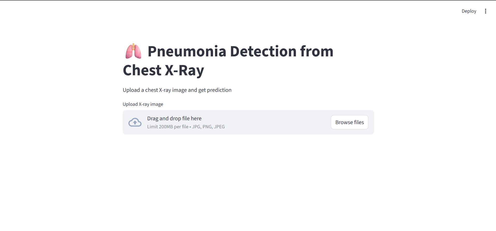
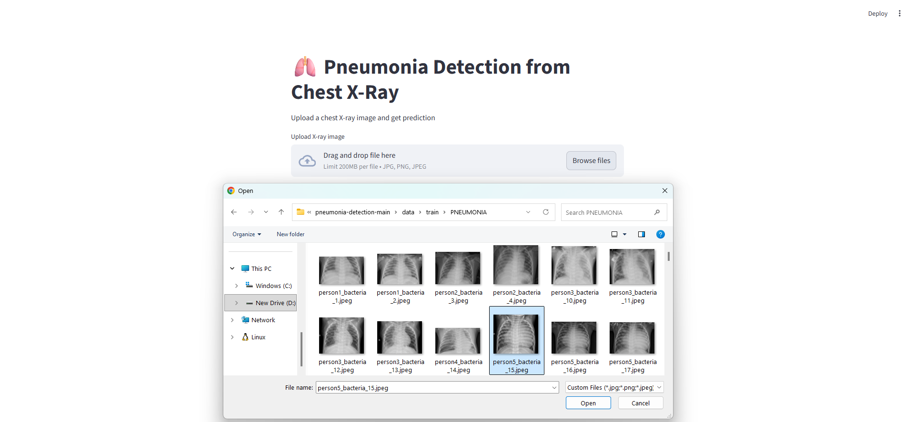
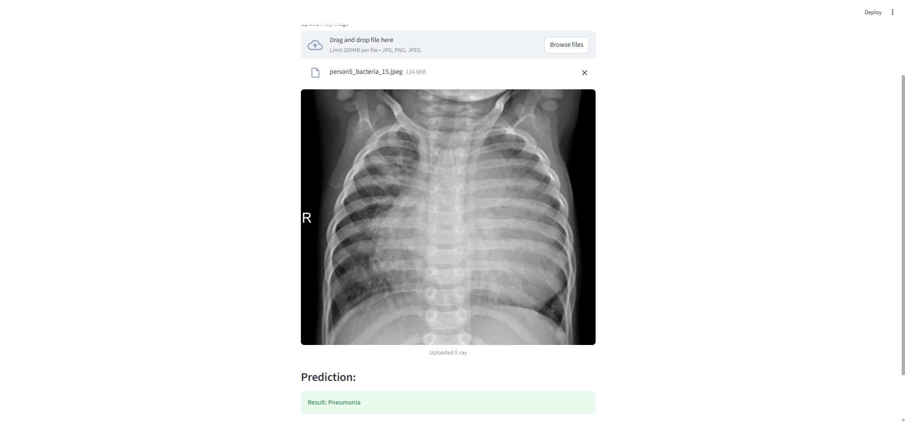

<h1 align="center">🫁 Pneumonia Detection from Chest X-ray</h1>

<p align="center">
  <b>AI-powered medical diagnosis system using Deep Learning</b><br>
  Built with ❤️ by <b>Rehan Vora</b>
</p>

<p align="center">
  <a href="https://github.com/rehanvhora778">
    
  </a>
  
  
  
</p>

---

## 🌟 Project Overview

This project is a **Deep Learning-based web application** that detects **Pneumonia from Chest X-ray images**.

💡 It simulates a real-world **medical AI system** where users can upload X-rays and get instant predictions.

---

## 🧠 Complete Workflow

```
Dataset → Preprocessing → Model Training → Evaluation → Deployment → Prediction
```

### 🔍 Step-by-step Explanation

* 📂 Collect dataset from Kaggle
* 🧹 Preprocess images (resize, normalize)
* 🧠 Train ResNet18 model using transfer learning
* 📊 Evaluate performance (accuracy, recall)
* 🌐 Deploy using Streamlit
* ⚡ Upload image → Get prediction

---

## 🖥️ Application Screenshots

### 🏠 Home Interface

<p align="center">
  
</p>

---

### 📤 Upload X-ray Image

<p align="center">
  
</p>

---

### 📊 Prediction Result

<p align="center">
  
</p>

---

## ✨ Features

* 📤 Upload chest X-ray images
* 🤖 Predict **Normal / Pneumonia**
* ⚡ Real-time AI prediction
* 🎯 High recall (medical focus)
* 🎨 Clean and simple UI

---

## 🧠 Model Details

| Component | Description        |
| --------- | ------------------ |
| Model     | ResNet18           |
| Technique | Transfer Learning  |
| Classes   | Normal / Pneumonia |
| Loss      | CrossEntropyLoss   |
| Optimizer | Adam               |

---

## 📊 Performance

| Metric          | Value |
| --------------- | ----- |
| Accuracy        | ~95%  |
| Recall          | ~96%  |
| False Negatives | 32    |

> ⚠️ In medical AI, reducing false negatives is critical
> This model prioritizes detecting Pneumonia cases correctly

---

## ⚙️ Installation & Setup (Detailed)

### 🔹 Step 1: Clone Repository

```bash
git clone https://github.com/rehanvhora778/pneumonia-detection.git
cd pneumonia-detection
```

---

### 🔹 Step 2: Install Dependencies

```bash
pip install -r requirements.txt
```

---

### 🔹 Step 3: Prepare Dataset

Download dataset from Kaggle and structure like:

```
dataset/
   ├── train/
   │     ├── NORMAL/
   │     ├── PNEUMONIA/
   ├── test/
         ├── NORMAL/
         ├── PNEUMONIA/
```

---

### 🔹 Step 4: Train Model

```bash
python train.py
```

✔️ This will:

* Train the ResNet18 model
* Save `.pth` model file

---

### 🔹 Step 5: Run Application

```bash
streamlit run app.py
```

✔️ Open browser → Upload image → Get prediction

---

## 📁 Project Structure

```
pneumonia-detection/
│
├── app.py
├── train.py
├── src/
├── dataset/
├── assets/        # Screenshots
├── requirements.txt
├── README.md
```

---

## 📂 Dataset

Chest X-ray dataset from Kaggle
(Not included due to size)

---

## ⚠️ Notes

* Model file (.pth) not included
* Must train before running app
* Ensure dataset is properly structured

---

## 🚀 Future Improvements

* Reduce false negatives
* Add confidence score
* Deploy online
* Improve model accuracy

---

## 🧠 Key Learnings

✔️ End-to-end ML pipeline
✔️ Transfer Learning
✔️ Medical AI evaluation
✔️ Streamlit deployment

---

## 👨‍💻 Author

<p align="center">
  <b>Rehan Vora</b><br>
  AI Developer | Full Stack Enthusiast<br><br>
  <a href="https://github.com/rehanvhora778">
    
  </a>
</p>

---

## ⭐ Support

If you like this project, give it a ⭐ on GitHub!
